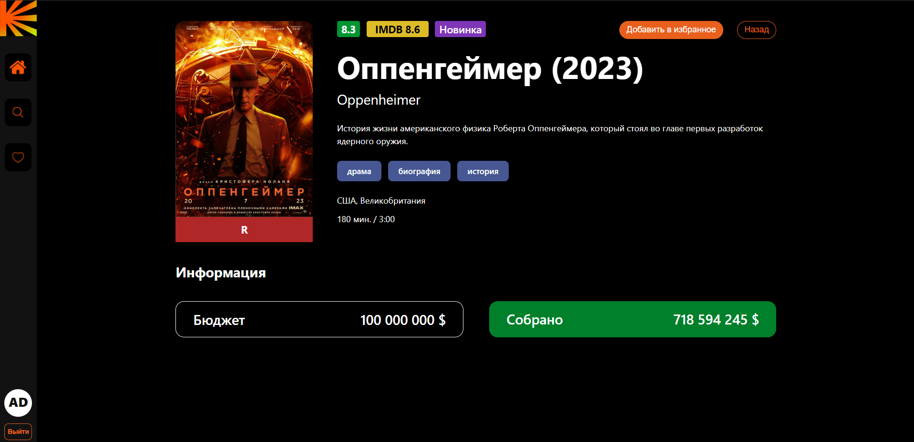
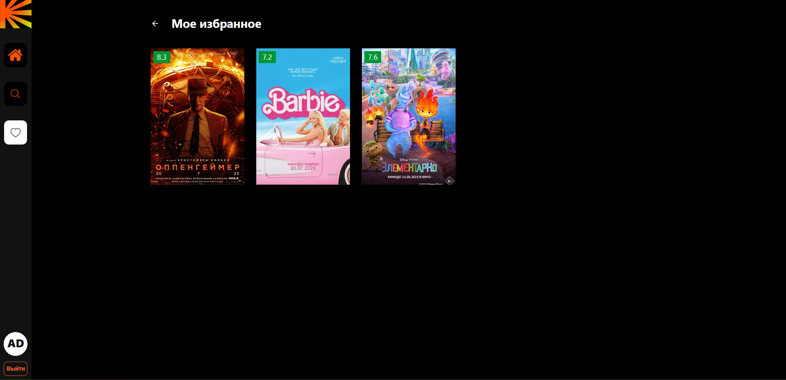
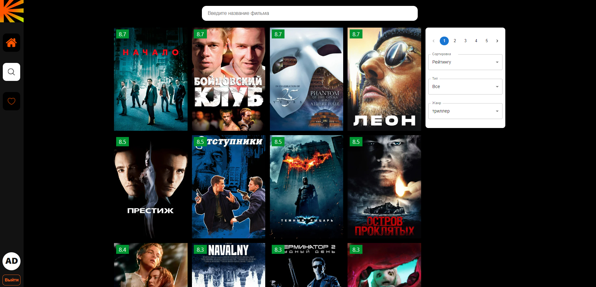

## MovieHub

MovieHub - это веб-приложение для истинных ценителей кинематографа, предоставляющее обширную базу данных фильмов, удобные инструменты для поиска, фильтрации и организации вашего кинопросмотра. Сайт предоставляет пользователю уникальный опыт, сфокусированный на удовольствии от просмотра и обмене впечатлениями о любимых фильмах.

# 🛠 Технологии:

- **ReactJS**
- **TypeScript**
- **Redux Toolkit**
- **React Router v6**
- **RTK Query**
- **React Hooks**
- **Prettier, StyleLint, ESLint**
- CSS-Modules / SCSS (стилизация)
- MUI (пагинация)
- generate-react-cli
- Firebase

# Ссылка на проект

https://movie-oc3jtehgy-hem1x.vercel.app/

# Приложение

